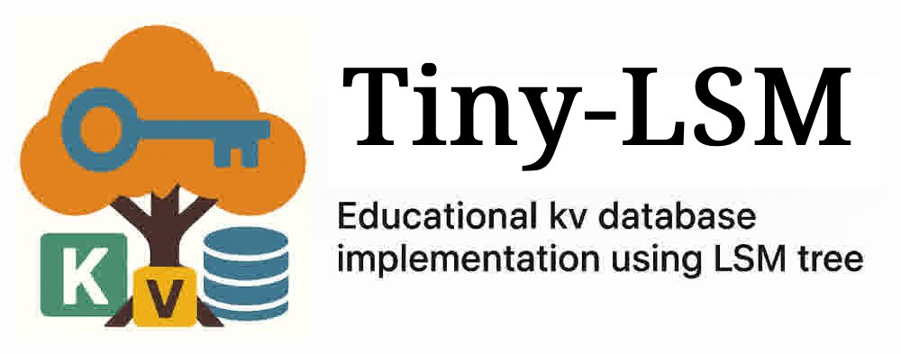

  

 

`Tiny-LSM` is a educational project to implement a simple kv database from scratch, using lsm-tree as the storage engine. The project manager uses [xmake](https://xmake.io/). The project is inspired by [mini-lsm](https://github.com/skyzh/mini-lsm), [tinykv](https://github.com/talent-plan/tinykv) and [leveldb](https://github.com/google/leveldb). The project is partly compatible with the [Redis Resp protocol](https://redis.io/docs/latest/develop/reference/protocol-spec/), so it can be used as a redis backend and relpace `redis-server`(Just for fun 🎮).

forked form "https://github.com/Vanilla-Beauty/tiny-lsm"
i delete a part of the readme file. This is the source repo:"https://github.com/Vanilla-Beauty/tiny-lsm"